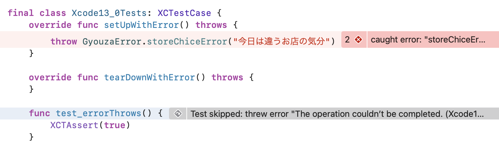

# Xcode 13.0
 - [Release Note](https://developer.apple.com/documentation/xcode-release-notes/xcode-13-release-notes)

## Testing
### テストの繰り返しがサポート
次の方法により特定の条件を満たすまでテストの繰り返し実行ができます。

 - Xcodeから指定
 - xcodebuildからオプションを指定

今回のサンプルコードでは次のようなオプションを利用しています。

```
// 失敗するまでテストを実行する
-run-tests-until-failure 
```

```
// 試行回数10回
-test-iterations 3
```

この2つを使うことでテストが失敗するまで3回施行します。
サンプルコードは失敗することがないので、毎回3回テストを実行します。


### 非同期のテスト
次のように `async` `async throws` とすることで非同期のテストを実装することができます。
`XCTestExpectation` を使って明示的に待つ必要性を減らしてくれています。

```
func test_chopVegetables() async throws {
    let vegetables = try await chopVegetables()
    XCTAssertEqual(vegetables.count, 2)
}
```

このサンプルテストコードにおけるプロダクトコード側のサンプルコードは次のような形としています。
`Task.sleep` で1秒処理をあえて待つようにしています。

```
func chopVegetables() async throws -> [Vegetable] {
    try await Task.sleep(for: .seconds(1.0))
    let vegetables: [Vegetable] = [.carrot, .watermelon]

    return vegetables
}
```


### setupWithError、tearDownWithErrorのサポート
次のようにsetUp時やtearDown時にエラーをThrowできるようになりました。
これによりsetUp時にエラーをThrowしていてもクラッシュするわけではなくてテストが失敗となります。

```
    override func setUpWithError() throws {
        throw GyouzaError.storeChiceError("今日は違うお店の気分")
    }

    override func tearDownWithError() throws {
    }

    func test_errorThrows() {
        XCTAssert(true)
    }
```


