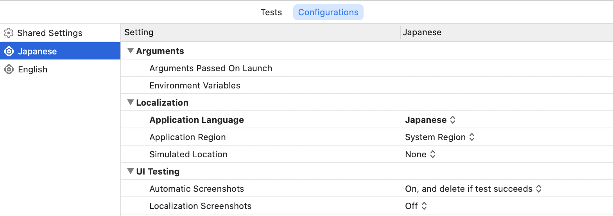

# Xcode11.0
 - [Release Note](https://developer.apple.com/documentation/xcode_release_notes/xcode_11_release_notes)

## Testing

### Test Plans
テストの実行条件を「Test Plans」で指定することができます。

 - すべて
   - ./xcode11.0/xcode11.0AllTests.xctestplan
 - ユニットテスト
   - ./xcode11.0Tests/xcode11.0.xctestplan
 - UIテスト
   - ./xcode11.0UITests/xcode11.0UITests.xctestplan

UIテストの「Test Plans」では次のようにApplication Languageで英語、日本語の設定をしています。




### Metrics
 - testLaunchPerformance
 - testPerformance

Metricsの設定データは次のplistファイルに保存されています。

 - [./Samples/Xcode11.0/xcode11.0.xcodeproj/xcshareddata/xcbaselines/](https://github.com/tarappo/ios_test_sample_code/tree/master/Samples/Xcode11.0/xcode11.0.xcodeproj/xcshareddata/xcbaselines/)


例）CPU Instructions Retired

```	<key>com.apple.dt.XCTMetric_CPU.instructions_retired</key>
<dict>
	<key>baselineAverage</key>
	<real>2.65e+05</real>
	<key>baselineIntegrationDisplayName</key>
	<string>Local Baseline</string>
	<key>maxPercentRelativeStandardDeviation</key>
	<real>100</real>
</dict>
```

### XCTUnwrap


### Result Bundle
