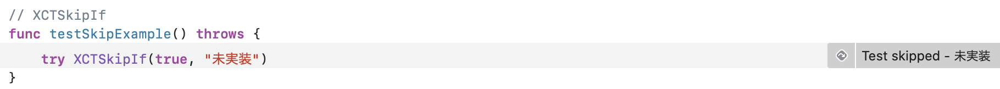
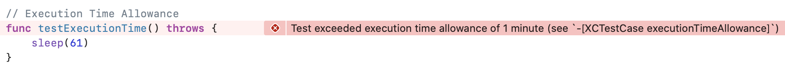

# Xcode11.4
 - [Release Note](https://developer.apple.com/documentation/xcode_release_notes/xcode_11_4_release_notes)

## Testing
### Execution Time Allowance
executionTimeAllowanceを58で指定しているので、1分以上かかるテストはすべて失敗します。

```
func testExecutionTimeExample() throws {
	sleep(61)
}
```




### XCTSkipIf
特定の条件を満たした場合テストをスキップできます。

```
func testSkipExample() throws {
	try XCTSkipIf(true, "未実装")
}
```

Skipした場合は成功/失敗ではなく次のようになります。



Test Reportも同様にSkipしたという情報になります。


## 参考資料
   - [Xode 11.4の「Testing」から「テストの実行時間の制限」と「テストのスキップ」の紹介](https://note.com/tarappo/n/n4af7c51334c5)
   - [Xcode 11.4  Betaのリリースノートの「Testing」の項目をいくつかピックアップして紹介](https://note.com/tarappo/n/na357aeefabe9)
