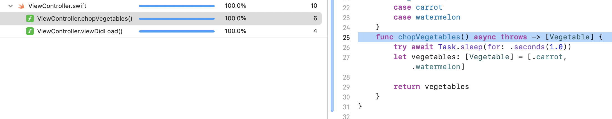

# Xcode 14.0
 - [Release Note](https://developer.apple.com/documentation/xcode-release-notes/xcode-14-release-notes)

## Testing
本バージョンではサンプルコードは特にありません。

### 並列化
今までは並列実行が有効になっていても、ターゲットについては直列に実行されていました。
Xcode 14.0以降はターゲットも含めて並列実行をすることができるようになりました。

### カバレッジレポートの表示強化
カバレッジレポートの表示が強化され、Executable Linesの表示や対象となるコードの表示などができるようになっています。

